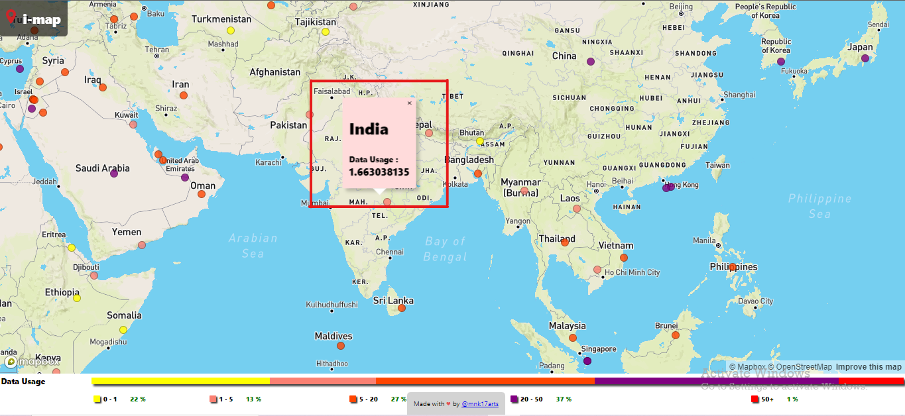

<!-- PROJECT DESCRIPTION -->

### Project Description

`i-map` is a simple React Web application built using the [React](https://reactjs.org/) framework and [Mapbox GL JS](https://docs.mapbox.com/mapbox-gl-js/api/). In this project I used `react-map-gl` for creating the interactive map. Which on clicking at the location will show the details of the location. The data I used in this project actually represents the Data Usage in that particular location.

I collected the data from various sources and comprised them into a JSON file. The data is in the form of an array of objects. Each object represents a location. The object contains the following properties:

- `id` - A unique identifier for the location
- `name` - The name of the location
- `latitude` - The latitude of the location
- `longitude` - The longitude of the location
- `dataUsage` - The data usage in that location

Example:

```json
[
  {
    "id": 1,
    "name": "New York",
    "latitude": 40.7128,
    "longitude": -74.006,
    "dataUsage": 0.5
  },
  {
    "id": 2,
    "name": "Los Angeles",
    "latitude": 34.0522,
    "longitude": -118.2437,
    "dataUsage": 0.3
  },
  {
    "id": 3,
    "name": "Chicago",
    "latitude": 41.8781,
    "longitude": -87.6298,
    "dataUsage": 0.2
  }
]
```

For instance I clicked on the Mark representing the location `India` in the map. It will show the details of the location `India` in the popup. The below image shows the example of the popup.




This project code is available in the [GitHub](https://github.com/mnk17arts/i-map) repository. 
The project is deployed in the [GitHub Pages](https://mnk17arts.github.io/i-map/).

What all I used in this project are:
`HTML, CSS, JavaScript, React, React-Map-GL, Mapbox GL JS, JSON, GitHub, GitHub Pages`